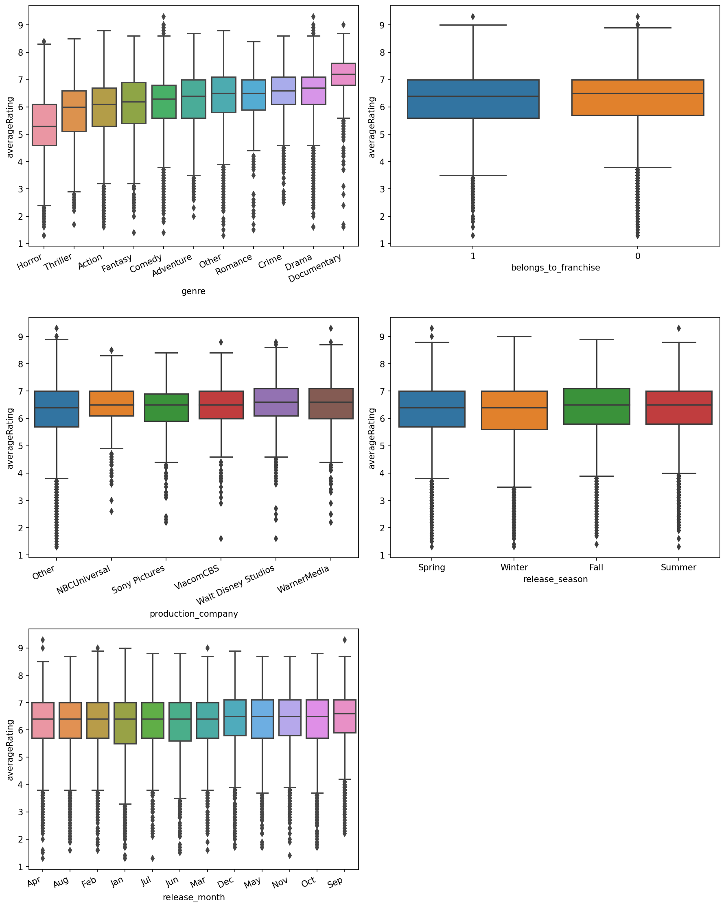
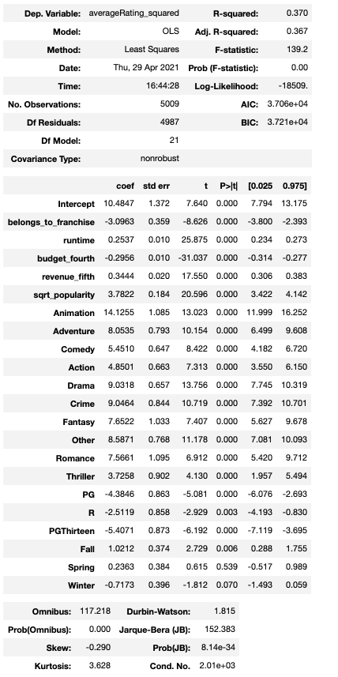
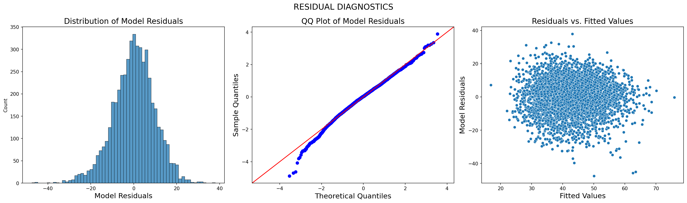
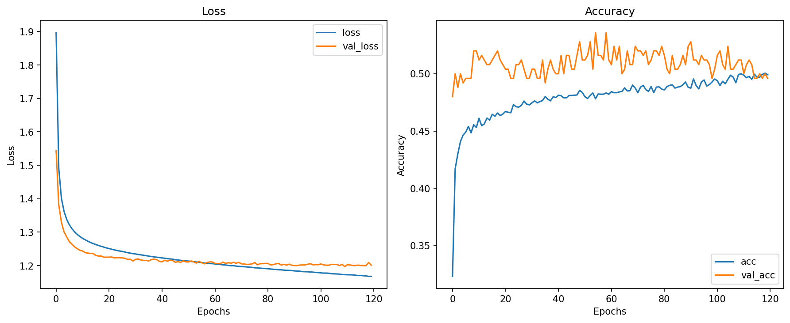

# Predicting a Film's IMDb Rating via Regression and Deep Learning

## Author: [Patricio Contreras](https://www.linkedin.com/in/pcontreras97/)

## Overview

This project is concerned with predicting a film's IMDb rating (0-10) given a select number of features.  We'll first read in the movie dataset and perform some exploratory data analysis (EDA).  After we have a solid understanding of the data, we'll clean it up and prepare it for the modelling stage.  Two models will be created for this project: a multiple linear regression model and a machine learning classifier.  The goal is to evaluate the performance of each and see which one ultimately predicts IMDb rating the best!

## Business Problem

Producing a film is by no means an easy endeavour.  Everyone in charged of producing a new film must take into account many different variables (e.g., genre, time of year, film runtime) in order to minimise the risk of making a dreaded "razzie".  Besides revenue and profit made, one metric used by many to evaluate the success of a film is the _IMDb rating_.

The goal of this project is to take into account several movie features (release date, language, etc.) and predict what the eventual IMDb rating will be.  By the end of this project, the model chosen should help movie producers make informed, data-driven decisions to maximise success.

## The Data

The data used for this project was taken from Kaggle's [The Movies Dataset](https://www.kaggle.com/rounakbanik/the-movies-dataset) page.  It can be found in the [data](data) folder under "archive".  The main csv file used for this project was `movies_metadata.csv`.

This csv file has information on over 40,000 films from 1874 all the way to 2017!  Features in this dataset include film genre, release date, runtime, IMDb rating, and budget (among others).

## Methods

The first two notebooks ([EDA](EDA.ipynb), [EDA_2](EDA_2.ipynb)) are mostly centred around exploratory data analysis (EDA) and data cleaning.  Visualisations such as histograms and boxplots were plotted to analyse the distribution of each individual variable and the relationship they have with the response: IMDb rating.

**Note:** While performing EDA and familiarising myself with the dataset, I picked up on 3 important details:

* the dataset mostly consists of categorical features (genre, production company, language, etc)
* _key_ features such as budget and revenue had 80% to 90% of their data missing
* while the dataset initially has a total of 24 features, about half were useful for my purposes

Since I didn't want to completely get rid of important columns like budget and revenue, I saved two copies of the DataFrame - `df` and `df_budget`.  The reason for doing this is because I wanted to measure how much columns affected our model's results.

Once EDA and data cleaning was performed, [Regression](Regression.ipynb) focuses on building a multiple linear regression model using the remaining features through an iterative process of model tuning.  Evaluation metrics such as *adjusted R-Squared* and 5 fold cross-validated *Root Mean Squared Error* (RMSE) were calculated along with visualisations of the model residuals.

Finally, the last notebook ([NN](NN.ipynb)) is responsible for creating a neural network model to predict IMDb ratings.  The response variable was converted into 10 different labels (0-9) and the model's accuracy and loss were calculated.  The same iterative process as in [Regression](Regression.ipynb) was followed and the model's validation, training, and test results were recorded.  Metrics such as accuracy and loss were used to evaluate the model's performance.

## Results

### Multiple Linear Regression

After cleaning the data as best as possible in [EDA](EDA.ipynb) and [EDA_2](EDA_2.ipynb), the following are some preliminary results obtained when constructing the multiple linear regression model:

As seen by the plots shown above, a film's IMDb rating was not really affected by the categorical variables in our dataset (perhaps with the exception of movie genre).  These findings were not ideal given that most of the data used to create our models was of categorical nature.

After adding/removing features from the model, applying transformations, re-scaling some variables, and removing outliers, the final multiple linear regression model had these characteristics:

Unfortunately, despite all of the changes to the data and model tuning, the final model achieved a relatively low *adjusted R-squared* value of 0.367.  In contrast, the model's residual diagnostics suggest that the model passed the residual assumptions of normality, mean of 0, and constant spread.  Finally, the model's 5 fold, cross-validated RMSE was 0.82.

### Neural Network

Although the iterative process for creating both models remained the same, constructing the neural network involved more _model_ tuning (changing architecture, batch size, complexity) than transforming the actual data.  The only changes made to the data to fit the neural network model was re-scaling our continuous features and discretizing/labelling our response variable.

After creating nine different networks by altering activation functions, model complexity, and network architecture, the final model had the following characteristics:

Unfortunately, after evaluating the model performance using the testing set, the model's accuracy was 50%.  Despite getting fairly close training and validation results, the network was not able to learn well on our training data and did not classify with a high degree of accuracy.

## Final Comments

Given the features used, both models were not able to predict IMDb rating very well.  Despite all the model tuning, feature engineering, transformations, and EDA, I cannot confidently recommend any of these models be used to predict IMDb rating.  As was shown throughout all the notebooks, the relationship between our predictors and response variable was weak and the model results further confirm this.

## Limitations

Having obtained these results, here are a couple of reasons why both models were not very successful:

* Models heavily relied on categorical features - the only four continuous features used were movie budget, revenue, runtime, and popularity, however, budget and revenue were only found in `final_dfbudget.csv` (which only had around 5000 rows!)

* Features had weak relationship with response - the response variable did not seem to be affected very much by many of our features

## Future Work

While these models proved to be unsuccessful, the problem could still be addressed through other methods:

* Obtain more data on continuous features - the addition of new features such as "Opening Weekend Box Office" or "Marketing Expenses" could improve the model's performance

* Try a different type of network - the model used for this project was a sequential, fully connected, neural network.  Consider other types of networks to learn from the training data

* Implement different methods - rather than discarding many descriptive columns (overview, tagline, etc.), perhaps some other learning process (e.g., NLP) could reveal some interesting findings

## For More Information

To see the full analysis, start off by checking out [EDA](EDA.ipynb).  For a more concise presentation, take a look at [presentation.pdf](presentation.pdf).